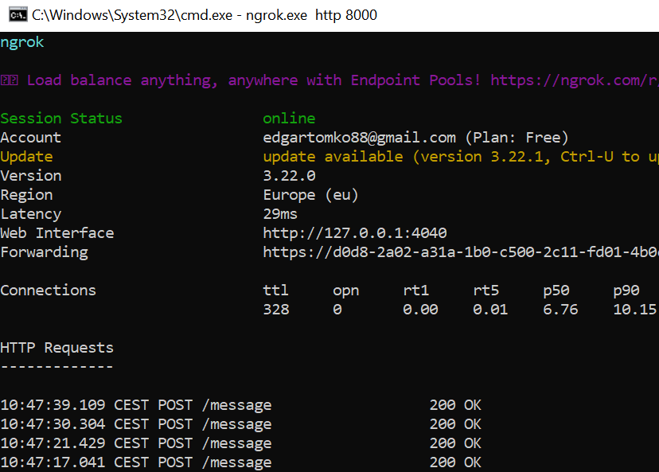
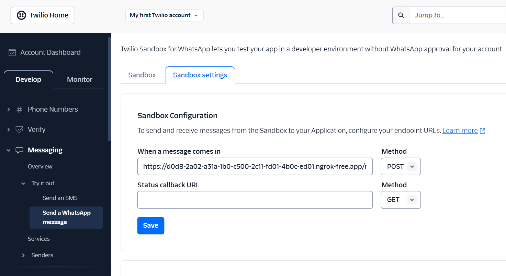

# WhatsApp Health Bot

A FastAPI-based WhatsApp chatbot that provides health tips, recipe recommendations, and nutritional guidance. The bot uses algorytm with forbidden foods and preferences for 27 dishes and integrates with Twilio for WhatsApp messaging.

## Features

- 🤖 WhatsApp integration via Twilio
- 🍳 Recipe recommendations using algorytm with forbidden foods and preferences for 27 dishes 
- 💡 Scheduled health tips delivery
- 🔄 User state management and caching
- 📁 Google Drive integration for file uploads
- 🗄️ Supabase database integration

## Prerequisites

- Docker and Docker Compose
- WhatsApp Business API access via Twilio
- OpenAI API key
- Google Drive API credentials
- Supabase project credentials

## Environment Variables

Create a `.env` file in the root directory with the following variables:

```env
# Twilio Configuration
ACCOUNT_SID=your_twilio_account_sid
AUTH_TOKEN=your_twilio_auth_token
TWILIO_NUMBER=your_twilio_whatsapp_number

# Supabase
SUPABASE_URL=your_supabase_url
SUPABASE_KEY=your_supabase_anon_key

# App Settings
DEBUG=True
BOT_LANGUAGE="en"  # "en" or "he" - Default language (English)
```


## Local Development Setup

1. Clone the repository:
```bash
git clone <repository-url>
cd whatsapp_chatbot
```

2. Prepare with Ngrok local tunnel and copy *Forwarding* address for set webhook in Twilio Console.
```bash
ngrok http 8000
```


Set webhook in Twilio Console, [link](https://console.twilio.com/us1/develop/sms/try-it-out/whatsapp-learn?frameUrl=%2Fconsole%2Fsms%2Fwhatsapp%2Flearn%3Fx-target-region%3Dus1)


3. Build and start the Docker containers:
```bash
docker-compose up --build
```

The API will be available at `http://localhost:8000`

## API Documentation

Once the application is running, you can access:
- Swagger UI documentation: `http://localhost:8000/docs`
- ReDoc documentation: `http://localhost:8000/redoc`

## Project Structure

```
whatsapp_chatbot/
├── app/
│   ├── api/
│   │   ├── controllers/
│   │   └── services/
│   ├── config/
│   ├── database/
│   ├── routes/
│   ├── services/
│   ├── utils/
│   ├── wa_hooks/
│   └── main.py
├── docker-compose.yml
├── Dockerfile
├── requirements.txt
└── README.md
```

## Main Components

- `app/main.py`: Application entry point and configuration
- `app/wa_hooks/`: WhatsApp message handling and bot menu service
- `app/services/`: Core business logic
- `app/api/`: API controllers and services
- `app/database/`: Database models and Supabase client
